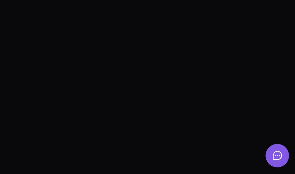
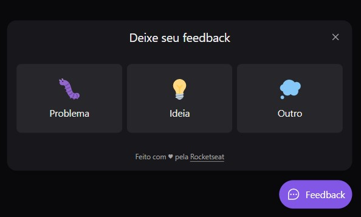
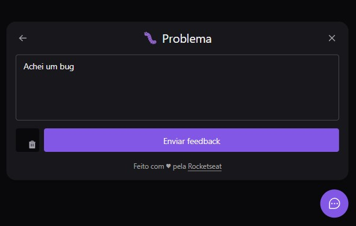
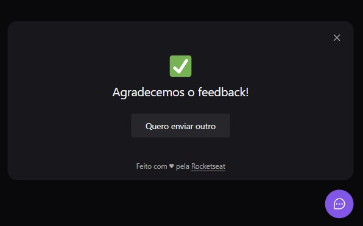

<h1 align="center">
  <center>Next Level Week - Return</center>
</h1>

> O projeto desenvolvido na oitava edição da NLW é o FeedGet, um widget acessível cujo objetivo é recolher reports de bugs, ideias e comentários de maneira centralizada e organizada.

## ✅ To Do List

- [x] Botão flutuante que abre ao ser clicado.
- [x] Possibilidade de escolher entre 3 opções de feedback.
- [x] Navegável por teclado (tab, esc, enter).
- [x] Tirar print da tela.
- [x] Remover print tirado.
- [x] Enviar feedback.
- [x] Sinalização de loading.
- [x] Mensagem de sucesso.
- [x] Possibilidade de enviar outro ao concluir o submit.
- [ ] Light mode

## 🖼️ Layout

- É possível acessar o layout feito pela Rocketseat [clicando nesse link pro Figma](https://www.figma.com/file/Tx913laHTXrGPiu9yVNy4b/Feedback-Widget-(Community)?node-id=100%3A2114).

## 📌 Parte 1 - Front End
<a href="https://nlw08-return.vercel.app/" target="_blank">Aplicação no ar</a>

|   |    |
| ------------------- | ------------------- |
|   |   |
|   |   |
|  |  |


### 🚀 Tecnologias utilizadas

- ReactJS
- ViteJS
- TypeScript
- Tailwind CSS
- Axios
- Headless UI
- Html 2 canvas
- Phosphor react

## 📌 Parte 2 - Back End

### 🚀 Tecnologias utilizadas

- NodeJS
- Express
- TypeScript
- Jest
- Nodemailer
- Prisma
- Postgresql
- Mailtrap

## 📌 Parte 3 - Mobile

### 🚀 Tecnologias utilizadas

- React Native
- TypeScript
- Expo
- Bottom sheet
- Axios
- Phosphor React Native
- Gesture handler

## 💻 Como rodar

1. Clonar o projeto: 
```bash
git clone git@github.com:lineavelino/nlw08-return.git
```
2. Entrar na pasta desejada: 
```bash
cd server
```
3. Instalar as dependências: 
```bash
npm install
```
4. Rodar o servidor
```bash
npm run dev
``` 

